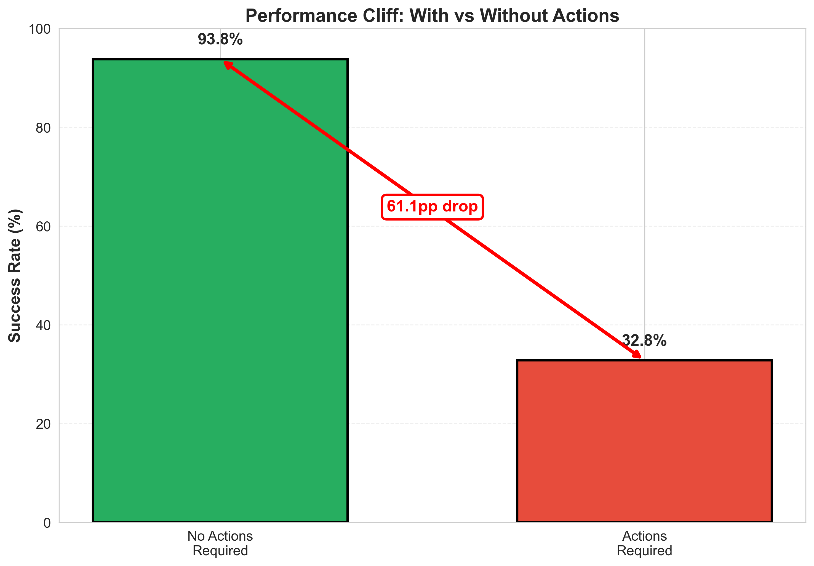

# Evaluating Grok on τ2-bench
## Analysis, Critique & Improvements

**Jit Ray Chowdhury**

---

# Agenda

**Presentation (30 min):**
1. **Overview of Benchmark**
2. **Analysis Results + Methodology** 
3. **Failure Visualizations**
4. **Improvements + Rationale**
5. **Live Demo**
6. **Next Steps & Key Takeaways**

**Q&A Session:** 15 minutes

---

<!-- _class: lead -->
# Part 1: Overview of Benchmark
*Understanding tau2-bench*

---

# What is tau2-bench?

**Purpose:** Evaluate conversational AI agents in customer service scenarios

**Key Features:**
- Multi-turn conversations with state management
- Tool calling: Complex tools need to be called in correct sequence
- Real-world complexity: Database operations, constraints, error handling

**Domains:**
- 🛫 Airline: Flight booking, reservations, cancellations
- 🛒 Retail: Orders, inventory, customer service
- 📞 Telecom: Account management, billing, troubleshooting

---

# tau2-bench Architecture

```
┌─────────────────────────────────────────────────────┐
│               Task Definition                       │
│        "Book cheapest flight using gift cards"      │
└──────────────────┬──────────────────────────────────┘
                   │
        ┌──────────┴──────────┐
        │                     │
    ┌───▼────┐          ┌─────▼────┐
    │  Agent │◄────────►│   User   │
    │  (LLM) │          │   (LLM)  │
    └───┬────┘          └─────┬────┘
        │                     │
        └──────────┬──────────┘
                   │
            ┌──────▼──────┐
            │ Environment │
            │  (Database) │
            └─────────────┘
```


---

# tau2-bench Metrics & Evaluation

**Primary Metrics:**
- **Task Success Rate:** Did the agent complete the user's goal?
- **Action Accuracy:** Were state-changing operations correct?
- **Tool Usage:** Efficiency and correctness of API calls

**Evaluation Setup:**
- 50 tasks for Airline domain
- 4 trials per task (200 simulations)
- Binary success/failure scoring

**Why tau2-bench?**
✅ Real-world deployment scenarios
✅ Tests sustained reasoning & multi-step planning
✅ Industry-adopted benchmark

---

<!-- _class: lead -->
# Part 2: Analysis Results + Methodology
*Grok-3 Performance Deep Dive*

---

# Executive Summary: Grok-3 Results

| Metric | Value | Industry Baseline |
|--------|-------|-------------------|
| **Task Success Rate** | 57.5% | 50-59% (comparable) |
| **Communication Success** | **97.0%** | Shows reasoning is intact ✓ |
| **Action Execution Failures** | 89.4% | Industry-wide: 48-89% ⚠️ |
| **Performance Drop (with actions)** | 61.1pp | 8-63pp (Grok is highest) |

**Dataset:** 200 simulations, 50 tasks, 4 trials each
**Total Tool Calls Analyzed:** 1,162
<span class="small">
Log file [baseline_airline_xai_grok3_gemini2_5_flash](enhanced_logs/archive/tau2-bench-jit/baseline_airline_xai_grok3_gemini2_5_flash.json)</span>

---

# Key Finding: The Execution Gap

**Critical Evidence:**
```
🔍 Primary Failure Modes (85 failed simulations):
  Communication failures: 6/85 (7.1%)  ✓ Understanding intact
  Database failures: 85/85 (100.0%)    ✗ Action execution
  Action execution failures: 76/85 (89.4%)

⚠️  Performance Cliff:
  No-action tasks: 93.8% success
  Action-required tasks: 32.8% success
  → 61.1pp drop when actions required

🚨 Most Problematic Actions:
  book_reservation: 84.8% failure (33 attempts)
  search_direct_flight: 78.8% failure (80 attempts)
  update_reservation_flights: 54.8% failure (84 attempts)
```

**Root Cause:** 100% ActionCheckFailure (validation errors, not reasoning)

<span class="small">
python scripts/non_enhanced/failure_analysis.py enhanced_logs/archive/tau2-bench-jit/baseline_airline_xai_grok3_gemini2_5_flash.json
</span>

---

# Critical Finding: Performance Cliff



**Without Actions Required:**
- Success Rate: 93.8%

**With Actions Required:**
- Success Rate: 32.8%

**Drop: 61.1 percentage points**

Grok-3's 61.1 percentage point drop is the largest among the flagship models, significantly higher than GPT-4.1 (31.7pp) and Claude 3.7 Sonnet (8.3pp).

---

# Full Model Comparison

<style scoped>
  table {
    font-size: 20px;
    line-height: 1.2;
  }
  th, td {
    padding: 8px 12px;
  }
</style>

| Model | Overall Success | Comm. Success | DB. Success | Write Action Acc. | Pass@1 | Pass@2 | Pass@3 | Pass@4 | Avg. Cost |
| :--- | :--- | :--- | :--- | :--- | :--- | :--- | :--- | :--- | :--- |
| **O4 Mini** | **59.0%** | 93.0% | 59.5% | 45.9% | 0.590 | 0.483 | 0.420 | 0.380 | $0.0505 |
| **Grok 3** | 57.5% | **97.0%** | 57.5% | 43.5% | 0.575 | 0.460 | 0.405 | 0.380 | $0.2318 |
| **GPT-4.1** | 56.0% | 95.0% | 58.0% | 57.7% | 0.560 | 0.457 | 0.420 | 0.400 | $0.0535 |
| **GPT-4.1 Mini** | 50.5% | 92.0% | 55.5% | 65.5% | 0.505 | 0.393 | 0.320 | 0.260 | **$0.0126** |
| **Claude 3.7 Sonnet** | 50.0% | 94.5% | 51.0% | **65.9%** | 0.500 | 0.410 | 0.375 | 0.360 | $0.3492 |
| **Gemini 2.5 Flash** | 47.0% | 91.5% | 49.0% | 19.1% | 0.470 | 0.353 | 0.305 | 0.280 | $0.0141 |

---

# Action Failure Cascade & Secondary Root Cause

**The Cascade Effect:**
| Actions Required | Success Rate | Drop |
|:---|:---:|:---:|
| 0 actions | 93.8% | baseline |
| 1 action | 40.6% | **-53.2pp** ⚠️ |
| 2-4 actions | 0-25% | catastrophic ❌ |

**Secondary: Context Length Pressure**
- Failed simulations use **1.3x more tokens** (3,431 vs 2,601)
- Each tool call + retry: ~200-500 tokens → vicious cycle

**Trial Inconsistency:**
- Trial 0: 66% → Trial 3: 50% (16pp degradation)
- Pass@4: 0.380 (shows lack of robustness)

---
# Standard tau2-bench Limitations

**What tau2-bench provides:**
- ✅ Final success/failure (binary)
- ✅ Reward score
- ✅ Cost/token usage

**What's missing:**
- ❌ Tool execution details
- ❌ Argument validation errors
- ❌ State change tracking
- ❌ Temporal patterns
- ❌ Error categorization

**Problem:** Can't distinguish planning failures from execution failures

---

# Enter: tau2-enhanced

**Solution:** Add comprehensive observability without modifying tau2-bench

**Captures:** Every tool call with full context, validation errors, state changes, timing
**Enables:** 15+ analysis methods, root cause analysis, performance bottleneck identification

**Methodology:**
```python
LoggingEnvironment wraps Environment (non-invasive)
  ↓
Intercepts make_tool_call()
  ↓
Captures: args, result, timing, state changes → Structured JSON
  ↓
LogAnalyzer → 15+ analysis methods → HTML reports
```

---

<!-- _class: lead -->
# Part 3: Failure Visualizations
*Understanding What Goes Wrong*

---

# Failure Analysis Deep Dive

**Error Distribution:** ActionCheckFailure: 100% (204 occurrences)

**Failure Subcategories:**
| Error Type | % of Failures |
|------------|---------------|
| Missing required fields | 39% |
| Wrong parameter types | 34% |
| Invalid values | 26% |

**Example:**
```json
{
  "tool": "book_reservation",
  "error": "Required field 'payment.gift_card_ids' missing",
  "provided": {"flight_id": "...", "passenger_ids": [...]}
}
```

**Key Insight:** Issue is not what the agent *says*, but what it *does*. Validation errors, not reasoning errors.

---

# Critical Tool Failures & Patterns

**Top Failing Tools:**
| Tool | Failure Rate | Attempts | Type |
|------|--------------|----------|------|
| `calculate` | 100.0% | 4  | Read-Only |
| `book_reservation` | 84.8% | 33 | State-changing |
| `search_direct_flight` | 78.8% | 80 | Read-Only |
| `send_certificate` | 66.7% | 12 | State-changing |

**Paradox:** State-changing tools (74.6% success) outperform read-only tools (41.5% success) — opposite of expected!

<span class="small">
Source: [Analysis Report](https://www.jitrc.com/tau2-enhanced/samples/analysis/baseline_airline_xai_grok3_gemini2_5_flash/analysis_report.md) Lines 331-332
</span>

**100% Failure Tasks (0/4 trials):**
- **Task 14:** "Book cheapest flight using gift cards and certificate" → Complex payment structure
- **Task 17:** "Update passenger, baggage, and flight details" → Coordinated changes
- **Task 20:** "Book flight with time and payment constraints" → Complex validation

---

# Example Failure: Task 14

**User Request:**
> "Book the cheapest flight using my gift cards and one certificate"

**Grok's Reasoning:** ✅ Correct
1. Searches flights
2. Identifies cheapest option
3. Calculates payment split across gift cards + certificate
4. Attempts booking

**Execution:** ❌ Failed
```
Error: ActionCheckFailure - Invalid payment structure
Expected: {payment: {gift_card_ids: [...], certificate_id: "..."}}
Provided: {payment: {method: "split", cards: [...], cert: "..."}}
```

**Result:** 0% success despite correct financial reasoning

---

# Visualization: State Change


---


<!-- _class: lead -->
# Part 4: Improvements + Rationale
*Systematic Solutions to Systematic Problems*

---

# Problem → Solution Mapping

| Problem | Evidence | Root Cause | Solution |
|---------|----------|------------|----------|
| 89.4% validation failures | ActionCheckFailure dominates | Parameter construction errors | **RetryManagedAgent** |
| 61.1pp performance drop | With actions: 32.8% vs 93.8% | Execution gap | **RetryManagedAgent** |
| 50% → 66% trial degradation | Consistent decline | Context accumulation | **ContextManagedAgent** |

**Hypothesis:** Combine both → Measurable improvement (model-dependent)
**POC Result:** Tool-level gains confirmed (+13pp), but task-level optimization requires careful tuning

---

# The Vicious Cycle Problem

The two root causes amplify each other, creating a vicious cycle that leads to task failure.

```
1. Complex tasks require multiple actions
              ↓
2. Action failures trigger retries
              ↓
3. Retries add 200-500 tokens per attempt
              ↓
4. More context → Performance cliffs at 1.5K and 3K
              ↓
5. Performance degradation → More action failures
              ↓
         [Back to step 2]
```

**Breaking the Cycle:**
- **`RetryManagedAgent`** reduces failures at step 2
- **`ContextManagedAgent`** prevents degradation at step 4
- **`EnhancedLLMAgent`** breaks the cycle at both points

---

# Why Enhanced Agents Over Alternatives?

| Approach | Pros | Cons | Chosen? |
|----------|------|------|---------|
| Better prompts | Easy | Doesn't fix validation | ❌ |
| Few-shot examples | Improves patterns | Limited to seen cases | ❌ |
| Fine-tuning | Model improvement | Needs data/compute | ❌ |
| **Retry logic** | **Addresses root cause** | **Efficiency cost** | ✅ |
| **Context mgmt** | **Prevents degradation** | **Needs tuning** | ✅ |

**Decision Rationale:**
- Validation errors are systematic and recoverable with clarification
- ✅ Addresses root cause: parameter construction errors
- ✅ Generalizes across all tools and domains
- ✅ Measurable tool-level improvement (proven in POC: +13pp tool success)
- ✅ Low overhead: Only triggers on failures

---

# RetryManagedAgent Architecture

```
┌──────────────────────────────────────────────────┐
│           LLM generates tool call                │
└─────────────────┬────────────────────────────────┘
                  │
                  ▼
         ┌────────────────┐
         │ Execute Tool   │
         └────────┬───────┘
                  │
           ┌──────┴──────┐
           │ Success?    │
           └──────┬──────┘
                  │
        ┌─────────┴─────────┐
        │                   │
       YES                 NO
        │                   │
        ▼                   ▼
    [Return]     ┌──────────────────┐
                 │ Classify Error   │
                 │ - Validation?    │
                 │ - Missing field? │
                 │ - Type error?    │
                 └────────┬─────────┘
                          │
                          ▼
                 ┌──────────────────┐
                 │ Retry (max 3)    │
                 │ with hints       │
                 └────────┬─────────┘
                          │
                    [Back to LLM]
```

---


# ContextManagedAgent & EnhancedLLMAgent

**Context Management Strategies:**
1. **Sliding Window:** Keep system message, task description, last N messages; drop middle history
2. **Compression:** Summarize old messages to maintain state consistency

**EnhancedLLMAgent = RetryManagedAgent + ContextManagedAgent**

**How They Work Together:**
- Context management: Proactive (before generation)
- Retry logic: Reactive (after failure)
- No interference: Clean separation of concerns

---


# Proof-of-Concept: Small-Scale Validation


**Sample:** 10 tasks × 2 trials = 20 simulations

| Agent | Tool Success | Task Success | vs Baseline |
|:---|:---:|:---:|:---:|
| llm_agent | 57.4% | 60.0% | - |
| context_agent | 59.3% | 60.0% | +1.9pp |
| retry_agent | 68.5% | 60.0% | **+11.1pp** ✓ |
| **enhanced_agent** | **70.4%** | 55.0% | **+13.0pp** ✓ |

**Initial Takeaway:** Retry mechanism shows promising double-digit tool success improvements! Context and combined approaches require further investigation.

**Reports:**
- [llm_agent](https://www.jitrc.com/tau2-enhanced/samples/analysis/airline_gemini2_5_flash_10tasks_llm_agent/enhanced_analysis_report.html)
- [retry_agent](https://www.jitrc.com/tau2-enhanced/samples/analysis/airline_gemini2_5_flash_10tasks_retry_agent/enhanced_analysis_report.html)
- [enhanced_agent](https://www.jitrc.com/tau2-enhanced/samples/analysis/airline_gemini2_5_flash_10tasks_enhanced_agent/enhanced_analysis_report.html)

---

# Key Design Decisions

**1. Non-invasive Monkey Patching**
- ✅ Backward compatible, no fork needed
- ✅ Users don't switch frameworks

**2. Structured Logging vs Simple Metrics**
- ✅ Capture everything: tool execution, state changes, timing
- ✅ 15+ analysis methods from single data collection
- ✅ Future-proof for new hypotheses

**3. Three Agent Variants (A/B Testing)**
- `retry_agent`: Isolated retry mechanism testing
- `context_agent`: Isolated context management testing
- `enhanced_agent`: Combined optimization
- ✅ Clear attribution of improvements

---

<!-- _class: lead -->
# Part 5: Live Demo
*Seeing It In Action*

---

# Demo Overview

**What We'll Show:**
1. Run analysis on captured logs → Generate reports
2. Explore interactive HTML reports (browser)
3. Quick simulation run using Grok API

---

# Demo 1: Running Analysis

**Command:**
```bash
python scripts/analyze_simple_logs.py \
  enhanced_logs/archive/tau2-bench-jit/baseline_airline_xai_grok3_gemini2_5_flash.json
```

**Output:** 3 comprehensive reports
- `enhanced_analysis_report.html` (interactive visualizations)
- `tool_report.html` (per-tool success rates & errors)
- `simulation_report.html` (full task/trial logs)

---

# Demo 2: Interactive HTML Reports

**Live Navigation in Browser:**
- Tool performance trends
- Temporal analysis
- Success rate breakdowns
- Error categorization
- Full simulation logs

---

# Demo 3: Live Simulation Run

**Single Task with Retry Agent:**
```bash
./tau2-enhanced run --domain airline_enhanced --agent retry_agent \
--agent-llm xai/grok-3 --user-llm xai/grok-4-fast-reasoning \
--num-trials 1 --save-to demo_1_task --task-ids 20
```

**10 Tasks (Optional)**
```bash
./tau2-enhanced run --domain airline_enhanced --agent llm_agent \
--agent-llm xai/grok-3 --user-llm xai/grok-4-fast-reasoning \
--num-trials 1 --save-to demo_10_task \
--max-concurrency 5 --num-tasks 10
```

**What happens:** Real-time tool execution with enhanced logging

---

<!-- _class: lead -->
# Part 6: Next Steps
*Future Work & Extensions*

---
<style scoped>
  {
    font-size: 20px;
  }
</style>
# Next Steps: Validation & Optimization

**1. Proof-of-Concept Completed (Gemini)**
- ✅ `retry_agent`: **+11.1pp** tool success improvement, maintained task success
- ⚠️ `enhanced_agent`: **+13.0pp** tool success improvement, but -5pp task success regression
- 🔍 **Key Finding:** Tool-level improvements don't always translate to task-level success

**2. Model-Specific Optimization**
- Analyze failure patterns per model (error signatures differ)
- Tune retry strategies & context thresholds per model
- Cross-domain validation (retail, telecom)

**3. Proposed Training Strategy**
- **Structured Output Training (~50k examples):** Reduce ActionCheckFailure from 89% to <45%
  - Focus: Payment structures, nested objects, parameter validation
- **Error Recovery Training:** Build error signature → recovery strategy mappings, train on retry patterns 
- **Context Management Dataset (~25k):** Prevent performance cliffs and confusion

**Expected Outcomes:** +5-15pp improvement, -15% tool calls through better planning

---

# Key Takeaways

**What This Demonstrates:**

1. **Analytical Depth:** Identified execution gap and discovered retry traps through comprehensive logging
2. **Technical Innovation:** Non-invasive observability without forking, enabling deep analysis
3. **Visual Tooling:** revealed hidden failure modes
4. **Reproducibility:** All code, data, analysis publicly available with complete methodology

**Core Innovation:**
> "Rigorous benchmark critique reveals hard truths with help of and analysis tooling. This framework enables discovery of these critical insights."

---

# Impact Statement

**Before tau2-enhanced:**
- Binary success/failure metrics
- No visibility into execution details
- Can't distinguish planning vs execution failures
- Limited to final results

**After tau2-enhanced:**
- 15+ analysis methods with structured logging
- Root cause analysis with error categorization
- Three specialized agents revealing optimization complexity
- Framework for discovering sample size bias and model-specific patterns

**Framework Effect:** Makes ANY tau2-bench evaluation more insightful, preventing costly production failures

---

# Final Slide: Q&A Preparation

**3 Exceptional Technical Accomplishments:**

1. **Acubed (Airbus):** Advanced aircraft localization from TRL 3 to 4 in one year
   - Improved performance from **30% to 98%** while reducing pipeline complexity and latency

2. **Waymo:** Generated synthetic degraded data to estimate LIDAR quality
   - Coordinated across hardware, perception software, and external customers

3. **Auro (CTO):** Initiated data-driven RL environment for learned driving policy (2019)
   - Built foundation for autonomous driving behavior https://aurobots.com/blog/

**Hardest Technical Problem Solved:** Building a full-stack self-driving car (perception, planning, controls, sim) from in 3 months after moving to the USA.

**Career Decisions:** Drive to contribute to hard, AI-based autonomous solutions at scale—from robotics and self-driving cars to AI agents.

---

# Questions?

**Contact:**
- GitHub: github.com/jitrc/tau2-enhanced
- Email: jit.ray.c@gmail.com

**Thank you!**

---

<!-- _class: lead -->
# Backup Slides

---

# Detailed Architecture: tau2-enhanced

```
┌─────────────────────────────────────────────────────┐
│                   tau2-bench CLI                     │
│                  (unchanged)                         │
└────────────────────┬────────────────────────────────┘
                     │
          ┌──────────┴──────────┐
          │  EnhancedRunner     │
          │  - Monkey patches    │
          │  - Captures instances│
          └──────────┬──────────┘
                     │
       ┌─────────────┴─────────────┐
       │   LoggingEnvironment      │
       │   - Wraps Environment     │
       │   - Intercepts tool calls │
       └─────────────┬─────────────┘
                     │
         ┌───────────┴───────────┐
         │                       │
    ┌────▼────┐           ┌──────▼──────┐
    │ Execution│           │    State    │
    │  Logger  │           │   Tracker   │
    └────┬────┘           └──────┬──────┘
         │                       │
         └───────────┬───────────┘
                     │
              ┌──────▼──────┐
              │   Enhanced  │
              │    Logs     │
              │   (JSONL)   │
              └─────────────┘
```

---

# Analysis Methods (15+)

**Statistical:**
- Basic statistics (mean, median, std dev)
- Confidence intervals (95%)
- Correlation analysis

**Performance:**
- Tool efficiency metrics
- Performance bottlenecks
- Temporal trend analysis

**Specialized:**
- Argument intelligence (complexity, security)
- Error pattern detection
- State change analysis


---

# Backup: Action/Function Call Failure Rate Comparison

<style scoped>
  table {
    font-size: 20px;
    line-height: 1.3;
  }
</style>

| Action | Grok 3 | GPT-4.1 | Claude 3.7 | O4 Mini | GPT-4.1 Mini | Gemini Flash |
| :--- | :---: | :---: | :---: | :---: | :---: | :---: |
| `calculate` | 100% | 100% | 100% | 100% | 100% | 100% |
| `book_reservation` | 85% | 69% | 58% | 72% | 67% | 100% |
| `update_reservation_flights` | 55% | 29% | 27% | 44% | 27% | 100% |
| `search_direct_flight` | **79%** | 28% | 30% | 54% | 24% | 54% |
| `update_reservation_baggages`| 63% | 71% | 46% | 71% | 67% | 71% |
| `send_certificate` | 67% | 75% | 33% | 67% | 17% | 92% |

---


# Backup: Why Not terminal-bench?
<style scoped>
  {
    font-size: 20px;
  }
</style>
While `terminal-bench` was considered, `tau2-bench` was chosen for its deeper analytical capabilities.

### `terminal-bench`: Pros
  *   **Practical & Broad Coverage:** Evaluates agents on real-world command-line tasks across several categories (e.g., coding, networking).
  *   **Reproducible:** No LLM-based user simulator means fully deterministic results.
  *   **Extensible:** Easy to add new tasks, including multi-modal ones.

### Rationale for Not Selecting
  *   **Tests Memorization over Agency:** The benchmark's structure can reward "memorized" solutions for specific problems rather than testing true agentic reasoning and problem-solving.
  *   **Lacks Analytical Depth:** The clean, non-messy environments and lack of diversity within similar tasks make it difficult to perform the deep, systematic failure analysis needed for root cause identification.
  *   **Superficial Scoring:** The brittle scoring metric can be gamed by superficial agent improvements, not necessarily reflecting an increase in robust capability.

---

# Backup: tau2-bench Sophistication
<style scoped>
  {
    font-size: 20px;
  }
</style>

The benchmark tests for four distinct and sophisticated categories of failure.

**1. Policy Violations** (14% of failures)
  - **Tests:** Will the agent break established rules to please a user?
  - **Example:** Agent agrees to cancel a non-refundable ticket after the user insists.

**2. User Claim Verification** (12% of failures)
  - **Tests:** Does the agent validate user claims against the database, or does it trust blindly?
  - **Example:** Agent offers a "Gold member" discount without checking the user's actual "Regular member" status.

**3. Reasoning & Calculation** (87% of failures) ← **Our Focus**
  - **Tests:** Can the agent execute complex, multi-step operations and calculations correctly?
  - **Example:** Agent fails to calculate the optimal payment split using gift cards and a certificate.

**4. Complex Intent Handling** (7% of failures)
  - **Tests:** Can the agent handle multi-part requests, context switching, and evolving user goals?
  - **Example:** User asks to cancel two bookings and modify a third, then adds a new request mid-conversation.
---


# Backup Demo: Running Analysis Baseline (Skip)
- Baseline: `scripts/non_enhanced/baseline_airline_grok3.json`
**Command (Non-enhanced):**
```bash
python scripts/non_enhanced/analyze_breakdown.py --results scripts/non_enhanced/baseline_airline_grok3.json
python scripts/non_enhanced/failure_analysis.py scripts/non_enhanced/baseline_airline_grok3.json
```
**Output:** *(show terminal output)*

---

# Backup: Proposed Training Strategy

## 1. Structured Output Training (~50k examples)

**Goal:** Reduce validation errors from root cause

**Focus Areas (from actual failure analysis):**
- `book_reservation`: 88.9% failure → Payment parameter structure
- `search_direct_flight`: 78.8% failure → Search parameter validation
- `update_reservation_flights`: 100% failure → Nested object handling

**Data Generation:**
```python
{
  "correct": {"payment": {"gift_card_ids": [...], "certificate_id": "..."}},
  "error": {"payment": {"method": "split", "cards": [...], "cert": "..."}}
}
```

**Target:** Reduce ActionCheckFailure from 89% to <45%

---

# Backup: Proposed Training Strategy (continued)

## 2. Model-Specific Error Recovery Training

**Approach:**
- Train on retry patterns that succeeded for each model
- Build error signature → recovery strategy mappings
- Adaptive strategies that switch based on error type

**Training Data:**
```python
{
  "error": "ActionCheckFailure: payment_id required",
  "failed_retry": {"payment": {"id": "cert_123", "amount": 348}},
  "successful_retry": {"payment_id": "cert_123", "amount": 348}
}
```

## 3. Context Management Dataset (~25k examples)

**Goal:** Prevent performance cliffs and confusion
**Focus:** Long conversations with state consistency
**Validation:** Monitor self-loop rate (<35%) and efficiency metrics

**Expected Outcomes:**
- Structural: +5-10pp from better parameter formatting
- Recovery: +3-5pp from intelligent retry strategies
- Efficiency: -15% tool calls through better planning

---

# Backup: Research Directions (Near-term)

**1. Multi-modal Evaluation:**
- Add tasks with image/document processing
- Test vision capabilities (receipt scanning, ID verification)
- Measure multi-modal reasoning

**2. Quality Metrics:**
- Implement politeness scoring
- Add bias detection
- Measure proactive behavior

**3. Adversarial Robustness:**
- Fault injection testing
- Edge case generation
- Stress test with ambiguous queries
