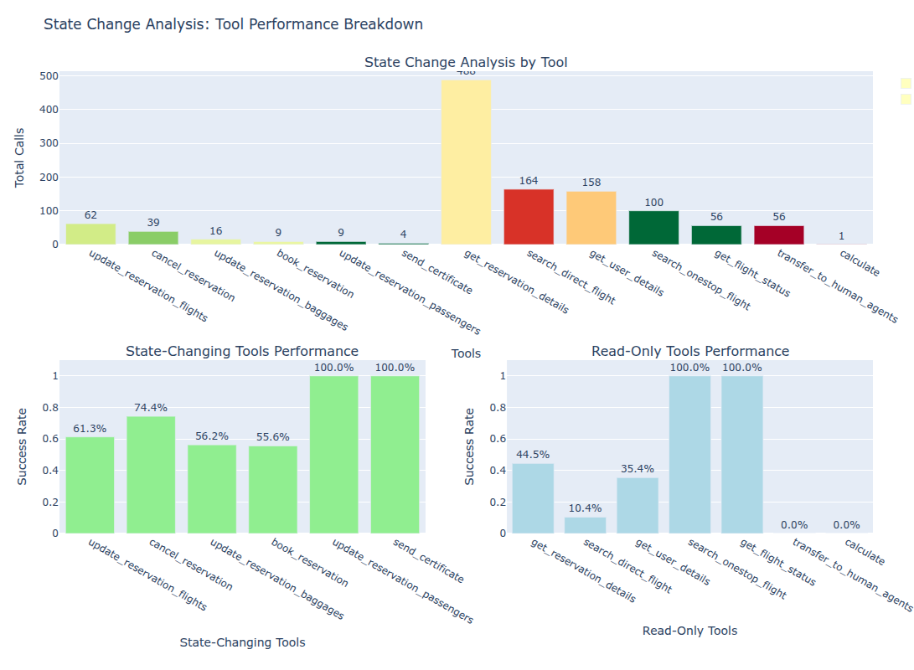
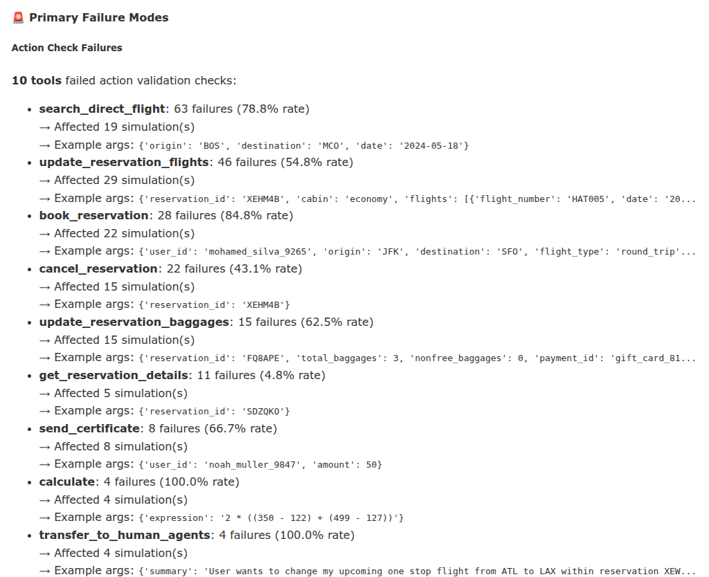

# Evaluating Grok on τ2-bench
## Analysis, Critique & Improvements

**Jit Ray Chowdhury**

---

# Agenda

**Presentation (30 min):**
1. **Overview of Benchmark**
2. **Analysis Results + Methodology** 
3. **Failure Visualizations**
4. **Improvements + Rationale**
5. **Live Demo**
6. **Next Steps & Key Takeaways**

**Q&A Session:** 15 minutes

---

<!-- _class: lead -->
# Part 1: Overview of Benchmark
*Understanding tau2-bench*

---

# What is tau2-bench?

**Purpose:** Evaluate conversational AI agents in customer service scenarios

**Key Features:**
- Multi-turn conversations with state management
- Tool calling: Complex tools need to be called in correct sequence
- Real-world complexity: Database operations, constraints, error handling

**Domains:**
- 🛫 Airline: Flight booking, reservations, cancellations
- 🛒 Retail: Orders, inventory, customer service
- 📞 Telecom: Account management, billing, troubleshooting

---

# tau2-bench Architecture

```
┌─────────────────────────────────────────────────────┐
│               Task Definition                       │
│        "Book cheapest flight using gift cards"      │
└──────────────────┬──────────────────────────────────┘
                   │
        ┌──────────┴──────────┐
        │                     │
    ┌───▼────┐          ┌─────▼────┐
    │  Agent │◄────────►│   User   │
    │  (LLM) │          │   (LLM)  │
    └───┬────┘          └─────┬────┘
        │                     │
        └──────────┬──────────┘
                   │
            ┌──────▼──────┐
            │ Environment │
            │  (Database) │
            └─────────────┘
```


---

# tau2-bench Metrics & Evaluation

**Primary Metrics:**
- **Task Success Rate:** Did the agent complete the user's goal?
- **Action Accuracy:** Were state-changing operations correct?
- **Tool Usage:** Efficiency and correctness of API calls

**Evaluation Setup:**
- 50 tasks for Airline domain
- 4 trials per task (200 simulations)
- Binary success/failure scoring

**Why tau2-bench?**
✅ Real-world deployment scenarios
✅ Tests sustained reasoning & multi-step planning
✅ Industry-adopted benchmark

---

<!-- _class: lead -->
# Part 2: Analysis Results + Methodology
*Grok-3 Performance Deep Dive*

---

# Executive Summary: Grok-3 Results

| Metric | Value | Industry Baseline |
|--------|-------|-------------------|
| **Task Success Rate** | 57.5% | 50-59% (comparable) |
| **Communication Success** | **97.0%** | Shows reasoning is intact ✓ |
| **Database Success** | **57.5%** | Failing to get to correct state ✓ |
| **Tool Action Success Rate** | 65.3% (384/588) | Varies 40-75% across models |
| **Performance Drop (with actions)** | 61.1pp (93.8 -> 32.8) | 8-63pp (Grok is highest) |

**Dataset:** 200 simulations, 50 tasks, 4 trials each
**Total Tool Calls Analyzed:** 1,162 (139 state-changing)
<span class="small">
Log file [baseline_airline_xai_grok3_gemini2_5_flash](samples/logs/baseline_airline_xai_grok3_gemini2_5_flash_reduced.json)</span>

---

# Key Finding: The Execution Gap

**Primary Failure Modes (85/200 failed simulations):**
- Communication failures: 6/85 (7.1%) ✓ Understanding intact
- Database failures: 85/85 (100.0%) ✗ Action execution
- Action execution failures: 76/85 (89.4%) ✗ Root cause


**Why High Communication Success ≠ Task Success:**
- Agent correctly understood and communicated, but couldn't execute `cancel_reservation`
- **Gap:** Understanding (97%) → Execution (57.5%) → 40pp execution gap
- **Gap:** 61.1pp drop when actions required (93.8 No-action, 32.8 Action required)

<span class="small">
Source: scripts/non_enhanced/failure_analysis.py + analyze_breakdown.py
</span>

---

# Failure Type Distribution

**📊 Three Distinct Failure Modes:**

| Type | % of Failures | Severity | Root Cause |
|------|---------------|----------|------------|
| **Never Called** | 80% (163) | Critical | Agent didn't recognize when to use tool |
| **Wrong Args** | 13% (27) | Medium | Parameter construction errors |
| **No Match** | 7% (14) | High | Execution logic mismatch |

**🚨 Highest Impact Failures:**
- `book_reservation`: 84.8% failure, **9.3 impact** (22 sims blocked)
- `update_reservation_flights`: 54.8% failure, **7.9 impact** (29 sims blocked)
- `search_direct_flight`: 78.8% failure, **7.5 impact** (19 sims blocked)

**Combined impact of top 3:**  Blocks 30% (61 unique simulations affected) of all failures

---

# Full Model Comparison

<style scoped>
  table {
    font-size: 20px;
    line-height: 1.2;
  }
  th, td {
    padding: 8px 12px;
  }
</style>

| Model | Overall Success | Comm. Success | DB. Success | Write Action Acc. | Pass@1 | Pass@2 | Pass@3 | Pass@4 | Avg. Cost |
| :--- | :--- | :--- | :--- | :--- | :--- | :--- | :--- | :--- | :--- |
| **O4 Mini** | **59.0%** | 93.0% | 59.5% | 45.9% | 0.590 | 0.483 | 0.420 | 0.380 | $0.0505 |
| **Grok 3** | 57.5% | **97.0%** | 57.5% | 43.5% | 0.575 | 0.460 | 0.405 | 0.380 | $0.2318 |
| **GPT-4.1** | 56.0% | 95.0% | 58.0% | 57.7% | 0.560 | 0.457 | 0.420 | 0.400 | $0.0535 |
| **GPT-4.1 Mini** | 50.5% | 92.0% | 55.5% | 65.5% | 0.505 | 0.393 | 0.320 | 0.260 | **$0.0126** |
| **Claude 3.7 Sonnet** | 50.0% | 94.5% | 51.0% | **65.9%** | 0.500 | 0.410 | 0.375 | 0.360 | $0.3492 |
| **Gemini 2.5 Flash** | 47.0% | 91.5% | 49.0% | 19.1% | 0.470 | 0.353 | 0.305 | 0.280 | $0.0141 |

---

# Action Complexity Impact

**Success Rate by Write Actions Required:**

| Write Actions | Tasks | Success Rate | Drop |
|:---|:---:|:---:|:---:|
| **0 actions** | 81 | **93.8%** | baseline |
| **1 action** | 64 | 40.6% | **-53.2pp** ⚠️ |
| **2+ actions** | 55 | 0-25% | catastrophic ❌ |

**Key Insight:**
- First action causes **53.2pp drop** — then plateaus at ~25%
- **Compounding Tool Success of only: 65.3%** State-changing 74.6%,  Read-only 41.5%


<span class="small">
Source: scripts/non_enhanced/analyze_breakdown.py
</span>

---

# Secondary Root Causes

**Context Length Pressure & Cost:**
- Failed simulations use **1.3x more tokens** (3,431 vs 2,601)
- Average cost per simulation: **$0.23** (failures cost more)
- Each tool call + retry: ~200-500 tokens → vicious cycle
- High self-loop rate (37.3%) compounds the problem

**Trial Inconsistency:**
- Trial 0: 66% → Trial 1: 58% → Trial 2: 56% → Trial 3: 50%
- **Pass@k metrics:** 0.575 → 0.460 → 0.405 → **0.380**
- 16pp degradation, Pass@4 only 38% (retrying makes it worse!)

---
# Standard tau2-bench Limitations

**What tau2-bench provides:**
- ✅ Final success/failure (binary)
- ✅ Reward score
- ✅ Cost/token usage

**What's missing:**
- ❌ Tool execution details
- ❌ Argument validation errors
- ❌ State change tracking
- ❌ Temporal patterns
- ❌ Error categorization

**Problem:** Can't distinguish planning failures from execution failures

---

# Enter: tau2-enhanced

**Solution:** Add comprehensive observability without modifying tau2-bench

**Captures:** Every tool call with full context, validation errors, state changes, timing
**Enables:** 15+ analysis methods, root cause analysis, performance bottleneck identification, **ground truth sequence comparison**

**Methodology:**
```python
LoggingEnvironment wraps Environment (non-invasive)
  ↓
Intercepts make_tool_call()
  ↓
Captures: args, result, timing, state changes → Structured JSON
  ↓
LogAnalyzer → 15+ analysis methods → HTML reports
```

---
# 15+ Analysis Methods
 **Failure Analysis**
- Impact scores, failure types, high frequency, root causes

**Performance Analysis**
- Tool success rates, timing, 
- State Changing vs Read Only, Complexity

**Sequence Analysis**
 - Ground truth comparison (Precision/Recall/F1)
 - Tool transitions and self-loops

**Workflow Patterns**
 - Argument accuracy, error patterns

---

# Impact Score: Prioritizing Failures

**Formula:** `failure_rate × simulations_affected / total_simulations × 100`

**Why Impact Score?**
- Combines **frequency** (how often it fails) with **reach** (how many simulations affected)
- Prioritizes failures that block the most user tasks
- Better than raw failure count alone

**Example:**
- Tool A: 100% failure, 2/100 sims → Impact **2.0**
- Tool B: 50% failure, 30/100 sims → Impact **15.0**
→ **Tool B is higher priority** despite lower failure rate

---

<!-- _class: lead -->
# Part 3: Failure Visualizations
*Understanding What Goes Wrong*

---

# Live Links to Reports

- [Enhanced Tau2 Analysis Report](https://www.jitrc.com/tau2-enhanced/samples/analysis/baseline_airline_xai_grok3_gemini2_5_flash/enhanced_analysis_report.html)

- [Tool Execution Analysis Report](https://www.jitrc.com/tau2-enhanced/samples/analysis/baseline_airline_xai_grok3_gemini2_5_flash/tool_report.html)

- [Comprehensive Simulation Report](https://www.jitrc.com/tau2-enhanced/samples/analysis/baseline_airline_xai_grok3_gemini2_5_flash/simulation_report.html)

- [Markdown Report](https://github.com/jitrc/tau2-enhanced/blob/ppt/samples/analysis/baseline_airline_xai_grok3_gemini2_5_flash/analysis_report.md)

---


# Failure Analysis: Impact-Ranked

**Top Impact Failures (204 total failures):**

| Tool | Impact | Failure Rate | Affected Sims | Type |
|------|--------|--------------|---------------|------|
| `book_reservation` | **9.3** | 84.8% | 22 | Never Called |
| `update_reservation_flights` | **7.9** | 54.8% | 29 | Never Called |
| `search_direct_flight` | **7.5** | 78.8% | 19 | Never Called |
| `update_reservation_baggages` | 4.7 | 62.5% | 15 | Never Called |

**Failure Type Distribution:**
- **Never Called:** 79.9% (163) — Agent didn't recognize need
- **Wrong Args:** 13.2% (27) — Parameter construction errors
- **No Match:** 6.9% (14) — Execution logic mismatch

**Key Insight:** Issue is not what the agent *says*, but what it *does*. Validation errors, not reasoning errors.

---

# Key Insights: Observability Gains

**Scale of Analysis:**
- **13 tools** analyzed across **1,162 calls** in 200 simulations
- **4 tools** excellent (≥95% success), **9 tools** poor (<75%)
- **17.6%** overall error rate across all tool calls

**The Self-Loop Problem:**
- **37.3%** of transitions are self-loops (repeated calls to same tool)
- `get_reservation_details` → self: **287x** (most common pattern)
- Indicates retry patterns and exploration failures

**High-Impact vs High-Volume:**
- `get_reservation_details`: 488 calls, 44.5% success, **0.1 impact** (recoverable)
- `book_reservation`: 9 calls, 55.6% success, **9.3 impact** (catastrophic)

---

# The Efficiency Crisis

**Sequence Comparison: Expected vs Actual (172 tasks, 592 ground truth actions)**

| Metric | Value | Problem |
|--------|-------|---------|
| **Precision** | 33.4% | 67% of executed actions are wrong |
| **Recall** | 61.2% | Missing 39% of required actions |
| **Waste** | 676 extra | 1,084 actual vs 592 expected (62% overhead) |
| **Arg Errors** | 46 | Even "correct" tools have wrong params |

**Does sequence order matter?** Not as much as you'd think:
- 75 tasks: Correct order → Success ✓
- **78 tasks: Correct order → Still Failed** ❌

**Key Insight:** Argument accuracy matters more than sequence order

**Extreme waste:** Task 23 executed **86 extra actions** (search loops spiraled out of control)


---

# 100% Failure Tasks

**5 Tasks Failed All 4 Trials:**
- **Tasks 7, 14, 29, 35, 44**

**Common Characteristics:**
- Complex payment logic (gift cards + certificates)
- Multi-step coordination (update passenger + baggage + flight)
- Constraint validation (time + payment + availability)

**Examples:**
- **Task 14:** "Book cheapest flight using gift cards and certificate"
- **Task 17:** "Update passenger, baggage, and flight details"
- **Task 20:** "Book flight with time and payment constraints"

---

# Example Failure: Task 14

**User Request:**
> "Book the cheapest flight using my gift cards and one certificate"

**Grok's Reasoning:** ✅ Correct
1. Searches flights
2. Identifies cheapest option
3. Calculates payment split across gift cards + certificate
4. Attempts booking

**Execution:** ❌ Failed
```
Error: ActionCheckFailure - Invalid payment structure
Expected: {payment: {gift_card_ids: [...], certificate_id: "..."}}
Provided: {payment: {method: "split", cards: [...], cert: "..."}}
```

**Result:** 0% success despite correct financial reasoning

---

# Common Error Patterns Across Failures

**📊 Top Runtime Errors (not ActionCheckFailures):**

| Error Message | Count | Pattern |
|---------------|-------|---------|
| Gift card balance is not enough | 9 | Resource constraint |
| Not enough seats on flight HAT229 | 3 | Inventory constraint |
| Certificate cannot be used to update | 1 | Policy violation |

**Key Observations:**
- **Task 21** failed all 4 trials: "Not enough seats on flight HAT229" (inventory issue)
- **Task 17, 22** repeatedly hit gift card balance errors across trials
- Indicates **environment state issues**, not just agent reasoning

**Implications:**
- Some failures are **unrecoverable** regardless of agent capability

---

# Task Consistency: Predictability Analysis

**Most Inconsistent Tasks (high variance across trials):**

Tasks with 50% success rate (2/4 trials passed):
- **Tasks 1, 2, 8, 15, 18, 19, 21, 24, 38, 42** (10 tasks)
- Variance: 0.50-0.58 (maximum inconsistency)

**What This Means:**
- **20% of tasks** (10/50) are **coin-flip unpredictable**
- Same task, same setup → different outcome each trial
- Not just hard tasks, but **non-deterministic** behavior
- Cannot rely on A/B testing with single trials

<span class="small">
Source: scripts/non_enhanced/analyze_breakdown.py - Variance analysis
</span>

---

# Visualization: State Change




---


<!-- _class: lead -->
# Part 4: Improvements + Rationale
*Systematic Solutions to Systematic Problems*

---

# Problem → Solution Mapping

| Problem | Evidence | Root Cause | Solution |
|---------|----------|------------|----------|
| 80% "Never Called" failures | 163 failures, top cause | Planning/tool selection | Few-shot examples + **RetryManagedAgent** |
| High-impact tool failures | book_reservation: 9.3 impact | Parameter construction | **RetryManagedAgent** + validation hints |
| Context accumulation | 37.3% self-loops, 287x get_reservation | Redundant calls | **ContextManagedAgent** |

**POC Result:** Tool-level gains confirmed (+13pp), but task-level optimization requires careful tuning

---

# The Vicious Cycle Problem

Impact-driven analysis reveals how failures compound:

```
1. Complex tasks require multiple actions
              ↓
2. High-impact tool failures (84.8% failure rate, book_reservation)
              ↓
3. Task failure → Agent confusion → Self-loops (get_reservation: 287x)
              ↓
4. Context accumulation (37.3% self-loop rate)
              ↓
5. Performance degradation → More action failures
              ↓
         [Back to step 2]
```
**Breaking the Cycle:**
- **`RetryManagedAgent`:** Reduce step 2 failures
- **`ContextManagedAgent`:** Prevent step 4 accumulation
- **`EnhancedLLMAgent`** breaks the cycle at both points

---

# Why Enhanced Agents Over Alternatives?

| Approach | Pros | Cons | Chosen? |
|----------|------|------|---------|
| Better prompts | Easy | Doesn't fix validation | ❌ |
| Few-shot examples | Improves patterns | Limited to seen cases | ❌ |
| Fine-tuning | Model improvement | Needs data/compute | ❌ |
| **Retry logic** | **Addresses root cause** | **Efficiency cost** | ✅ |
| **Context mgmt** | **Prevents degradation** | **Needs tuning** | ✅ |

**Decision Rationale:**
- Validation errors are systematic and recoverable with clarification
- ✅ Addresses root cause: parameter construction errors
- ✅ Generalizes across all tools and domains
- ✅ Measurable tool-level improvement (proven in POC: +13pp tool success)
- ✅ Low overhead: Only triggers on failures

---

# RetryManagedAgent Architecture

```
┌──────────────────────────────────────────────────┐
│           LLM generates tool call                │
└─────────────────┬────────────────────────────────┘
                  │
                  ▼
         ┌────────────────┐
         │ Execute Tool   │
         └────────┬───────┘
                  │
           ┌──────┴──────┐
           │ Success?    │
           └──────┬──────┘
                  │
        ┌─────────┴─────────┐
        │                   │
       YES                 NO
        │                   │
        ▼                   ▼
    [Return]     ┌──────────────────┐
                 │ Classify Error   │
                 │ - Validation?    │
                 │ - Missing field? │
                 │ - Type error?    │
                 └────────┬─────────┘
                          │
                          ▼
                 ┌──────────────────┐
                 │ Retry (max 3)    │
                 │ with hints       │
                 └────────┬─────────┘
                          │
                    [Back to LLM]
```

---


# ContextManagedAgent & EnhancedLLMAgent

**Context Management Strategies:**
1. **Sliding Window:** Keep system message, task description, last N messages; drop middle history
2. **Compression:** Summarize old messages to maintain state consistency

**EnhancedLLMAgent = RetryManagedAgent + ContextManagedAgent**

**How They Work Together:**
- Context management: Proactive (before generation)
- Retry logic: Reactive (after failure)
- No interference: Clean separation of concerns

---


# Proof-of-Concept: Small-Scale Validation (Gemini Flash)

**Sample:** 10 tasks × 2 trials = 20 simulations (54 expected actions per task set)

| Agent | Tool Success | Task Success | Precision | Recall | F1 | Matched | Extra Actions |
|:---|:---:|:---:|:---:|:---:|:---:|:---:|:---:|
| llm_agent | 57.4% | 60.0% | 3.87% | 29.63% | 6.85% | 16/54 | 359 |
| context_agent | 59.3% | 60.0% | 3.12% | 25.93% | 5.58% | 14/54 | 401 |
| retry_agent | 68.5% | 60.0% | 3.27% | 31.48% | 5.92% | 17/54 | 466 |
| **enhanced_agent** | **70.4%** | 55.0% | 3.78% | 37.04% | 6.86% | 20/54 | 482 |


**Tool Success Improvement:** +11-13pp ✓ (Retry mechanism proven effective)

---
# Proof-of-Concept: Insights and Learnings

**Sequence Comparison Insights:**
- **RetryAgent:** +11pp tool success, +1 matched action, but +107 extra actions (466 vs 359)
- **ContextAgent:** Minimal improvement (+2pp tool), actually worse precision/recall
- **EnhancedAgent:** Best precision (3.78%) and recall (37.04%), but generates most extra actions (482)
- **Critical Finding:** +13pp tool success doesn't translate to task success (55% vs 60% baseline)
- **Root Cause:** All agents have ~3% precision and 26-37% recall — sequence planning fundamentally broken

**Key Learning:** Tool-level improvements ≠ Task-level success without addressing:
1. **Precision Crisis:** 96-97% of executed actions are unnecessary (extra actions)
2. **Recall Gap:** Missing 63-74% of required actions
3. **Exploration Waste:** 359-482 extra actions per 54 expected actions (6.6-8.9× overhead)

---

# Reports

- [llm_agent](https://www.jitrc.com/tau2-enhanced/samples/analysis/airline_gemini2_5_flash_10tasks_llm_agent/enhanced_analysis_report.html)
    - [tool](https://www.jitrc.com/tau2-enhanced/samples/analysis/airline_gemini2_5_flash_10tasks_llm_agent/tool_report.html)
    - [simulation_report](https://www.jitrc.com/tau2-enhanced/samples/analysis/airline_gemini2_5_flash_10tasks_llm_agent/simulation_report.html)    
- [retry_agent](https://www.jitrc.com/tau2-enhanced/samples/analysis/airline_gemini2_5_flash_10tasks_retry_agent/enhanced_analysis_report.html)
  - [tool](https://www.jitrc.com/tau2-enhanced/samples/analysis/airline_gemini2_5_flash_10tasks_retry_agent/tool_report.html)
  - [simulation_report](https://www.jitrc.com/tau2-enhanced/samples/analysis/airline_gemini2_5_flash_10tasks_retry_agent/simulation_report.html)
- [enhanced_agent](https://www.jitrc.com/tau2-enhanced/samples/analysis/airline_gemini2_5_flash_10tasks_enhanced_agent/enhanced_analysis_report.html)
  - [tool](https://www.jitrc.com/tau2-enhanced/samples/analysis/airline_gemini2_5_flash_10tasks_enhanced_agent/tool_report.html)
  - [simulation_report](https://www.jitrc.com/tau2-enhanced/samples/analysis/airline_gemini2_5_flash_10tasks_enhanced_agent/simulation_report.html)


---

# Key Design Decisions

**1. Non-invasive Monkey Patching**
- ✅ Backward compatible, no fork needed
- ✅ Users don't switch frameworks

**2. Structured Logging vs Simple Metrics**
- ✅ Capture everything: tool execution, state changes, timing
- ✅ 15+ analysis methods from single data collection
- ✅ Future-proof for new hypotheses

**3. Three Agent Variants (A/B Testing)**
- `retry_agent`: Isolated retry mechanism testing
- `context_agent`: Isolated context management testing
- `enhanced_agent`: Combined optimization
- ✅ Clear attribution of improvements

---

<!-- _class: lead -->
# Part 5: Live Demo
*Seeing It In Action*

---

# Demo Overview

**What We'll Show:**
1. Run analysis on captured logs → Generate reports
2. Explore interactive HTML reports (browser)
3. Quick simulation run using Grok API

---

# Demo 1: Running Analysis

**Command:**
```bash
python scripts/analyze_simple_logs.py \
  samples/logs/baseline_airline_xai_grok3_gemini2_5_flash_reduced.json
```

**Output:** 3 comprehensive reports
- `enhanced_analysis_report.html` (Top Level Sumamry)
- `tool_report.html` (per-tool success rates, errors, sequence accuracy)
- `simulation_report.html` (full task/trial logs with sequences, args compared and error pattern)
- `analysis_report.md` (markdown summary with sequence metrics)

---

# Demo 2: Interactive HTML Reports

**Live Navigation in Browser:**
- Tool performance trends
- Temporal analysis
- Success rate breakdowns
- Error categorization
- Full simulation logs

---

# Demo 3: Live Simulation Run

**Single Task with Retry Agent:**
```bash
./tau2-enhanced run --domain airline_enhanced --agent retry_agent \
--agent-llm xai/grok-3 --user-llm xai/grok-4-fast-reasoning \
--num-trials 1 --save-to demo_1_task --task-ids 20
```

**10 Tasks (Optional)**
```bash
./tau2-enhanced run --domain airline_enhanced --agent llm_agent \
--agent-llm xai/grok-3 --user-llm xai/grok-4-fast-reasoning \
--num-trials 1 --save-to demo_10_task \
--max-concurrency 5 --num-tasks 10
```

**What happens:** Real-time tool execution with enhanced logging

---

<!-- _class: lead -->
# Part 6: Next Steps
*Future Work & Extensions*

---
<style scoped>
  {
    font-size: 20px;
  }
</style>
# Next Steps: Validation & Optimization

**1. Proof-of-Concept Completed (Gemini Flash)**
- ✅ `retry_agent`: **+11.1pp** tool success (57.4% → 68.5%), maintained task success at 60%
- ⚠️ `enhanced_agent`: **+13.0pp** tool success (57.4% → 70.4%), but -5pp task success (60% → 55%)
- 🔍 **Key Finding:** Tool-level improvements don't translate to task-level success
**2. Impact-Driven Optimization Priorities**

**Priority 1: High-Impact Tool Failures (Impact >5.0)**
- Target: `book_reservation` (9.3), `update_reservation_flights` (7.9), `search_direct_flight` (7.5)
- **Action:** Targeted retry logic + validation hints

**Priority 2: "Never Called" Failures (80%)**
- **Action:** Few-shot examples for tool selection

**Priority 3: Efficiency Crisis (62% wasted actions)**
- **Problem:** 1,084 actual vs 592 expected actions (33.4% precision, 62% waste)
- **Action:** Early stopping criteria, exploration limits, better planning, state management
---

# Proposed Training Strategy

**Structured Output Training (~50k examples):**
- **Target:** Reduce "Wrong Args" failures (13.2% → <5%)
- **Focus:** Payment structures, nested objects from impact-ranked failures

**Tool Selection Training:**
- **Target:** Reduce "Never Called" failures (80% → <40%)
- **Method:** Few-shot examples, explicit tool use guidance

**Context Management Dataset (~25k):**
- **Target:** Prevent self-loops and degradation
- **Method:** Teach when to stop redundant calls


---

# Key Takeaways

**What This Demonstrates:**

1. **Analytical Depth:** Impact Score methodology reveals that 3 tools block 60 simulations (30% of failures)
2. **Technical Innovation:** Non-invasive observability without forking, enabling deep analysis
3. **Failure Taxonomy:** 80% "Never Called", 13% "Wrong Args", 7% "No Match" — each needs different fix
4. **Sequence Analysis:** Ground truth comparison shows 33% precision, 61% recall — 62% waste (676 extra per 592 expected actions)
5. **Reproducibility:** All code, data, analysis publicly available with complete methodology

---
# Impact Statement
**Before tau2-enhanced:**
- Binary success/failure metrics
- No visibility into execution details
- Can't prioritize which failures to fix first
- Limited to final results

**After tau2-enhanced:**
- **Prioritize:** Impact scores vs High Frequency
- **Root Cause:** , failure types, self-loop rates, error patterns, sequence accuracy
- **Observability:** Self-loop rates (37.3%), error patterns, state changes across 1,162 tool calls
- **Actionable:** Three specialized agents tested (+11-13pp tool success proven)

---

# Final Slide: Q&A Preparation

**3 Exceptional Technical Accomplishments:**

1. **Acubed (Airbus):** Advanced aircraft localization from TRL 3 to 4 in one year
   - Improved performance from **30% to 98%** while reducing pipeline complexity and latency

2. **Waymo:** Generated synthetic degraded data to estimate LIDAR quality
   - Coordinated across hardware, perception software, and external customers

3. **Auro (CTO):** Initiated data-driven RL environment for learned driving policy (2019)
   - Built foundation for autonomous driving behavior https://aurobots.com/blog/

**Hardest Technical Problem Solved:** Building a full-stack self-driving car (perception, planning, controls, sim) from in 3 months after moving to the USA.

**Career Decisions:** Drive to contribute to hard, AI-based autonomous solutions at scale—from robotics and self-driving cars to AI agents.

---

# Questions?

**Contact:**
- GitHub: github.com/jitrc/tau2-enhanced
- Email: jit.ray.c@gmail.com

**Thank you!**

---

<!-- _class: lead -->
# Backup Slides

---

# Detailed Architecture: tau2-enhanced

```
┌─────────────────────────────────────────────────────┐
│                   tau2-bench CLI                    │
│                  (unchanged)                        │
└────────────────────┬────────────────────────────────┘
                     │
          ┌──────────┴───────────┐
          │  EnhancedRunner      │
          │  - Monkey patches    │
          │  - Captures instances│
          └──────────┬───────────┘
                     │
       ┌─────────────┴─────────────┐
       │   LoggingEnvironment      │
       │   - Wraps Environment     │
       │   - Intercepts tool calls │
       └─────────────┬─────────────┘
                     │
         ┌───────────┴────────────┐
         │                        │
    ┌────▼─────┐           ┌──────▼──────┐
    │ Execution│           │    State    │
    │  Logger  │           │   Tracker   │
    └────┬─────┘           └──────┬──────┘
         │                        │
         └───────────┬────────────┘
                     │
              ┌──────▼──────┐
              │   Enhanced  │
              │    Logs     │
              │   (JSON)    │
              └─────────────┘
```

---

# Backup: Action/Function Call Failure Rate Comparison

<style scoped>
  table {
    font-size: 20px;
    line-height: 1.3;
  }
</style>

| Action | Grok 3 | GPT-4.1 | Claude 3.7 | O4 Mini | GPT-4.1 Mini | Gemini Flash |
| :--- | :---: | :---: | :---: | :---: | :---: | :---: |
| `calculate` | 100% | 100% | 100% | 100% | 100% | 100% |
| `book_reservation` | 85% | 69% | 58% | 72% | 67% | 100% |
| `update_reservation_flights` | 55% | 29% | 27% | 44% | 27% | 100% |
| `search_direct_flight` | **79%** | 28% | 30% | 54% | 24% | 54% |
| `update_reservation_baggages`| 63% | 71% | 46% | 71% | 67% | 71% |
| `send_certificate` | 67% | 75% | 33% | 67% | 17% | 92% |

---

# Backup: Why Not terminal-bench?

While `terminal-bench` was considered, `tau2-bench` was chosen for its deeper analytical capabilities.

### `terminal-bench`: Pros
- **Practical & Broad Coverage:** Evaluates agents on real-world command-line tasks across several categories (e.g., coding, networking).
- **Reproducible:** No LLM-based user simulator means fully deterministic results.
- **Extensible:** Easy to add new tasks, including multi-modal ones.

### Rationale for Not Selecting
- **Tests Memorization over Agency:** The benchmark's structure can reward "memorized" solutions for specific problems rather than testing true agentic reasoning and problem-solving.
- **Lacks Analytical Depth:** The clean, non-messy environments and lack of diversity within similar tasks make it difficult to perform the deep, systematic failure analysis needed for root cause identification.

---

# Backup: tau2-bench Sophistication
<style scoped>
  {
    font-size: 20px;
  }
</style>

The benchmark tests for four distinct and sophisticated categories of failure.

**1. Policy Violations** (14% of failures)
  - **Tests:** Will the agent break established rules to please a user?
  - **Example:** Agent agrees to cancel a non-refundable ticket after the user insists.

**2. User Claim Verification** (12% of failures)
  - **Tests:** Does the agent validate user claims against the database, or does it trust blindly?
  - **Example:** Agent offers a "Gold member" discount without checking the user's actual "Regular member" status.

**3. Reasoning & Calculation** (87% of failures) ← **Our Focus**
  - **Tests:** Can the agent execute complex, multi-step operations and calculations correctly?
  - **Example:** Agent fails to calculate the optimal payment split using gift cards and a certificate.

**4. Complex Intent Handling** (7% of failures)
  - **Tests:** Can the agent handle multi-part requests, context switching, and evolving user goals?
  - **Example:** User asks to cancel two bookings and modify a third, then adds a new request mid-conversation.
---


# Backup Demo: Running Analysis Baseline (Skip)
- Baseline: `scripts/non_enhanced/baseline_airline_grok3.json`
**Command (Non-enhanced):**
```bash
python scripts/non_enhanced/analyze_breakdown.py --results scripts/non_enhanced/baseline_airline_grok3.json
python scripts/non_enhanced/failure_analysis.py scripts/non_enhanced/baseline_airline_grok3.json
```
**Output:** *(show terminal output)*

---

# Backup: Proposed Training Strategy

## 1. Structured Output Training (~50k examples)

**Goal:** Reduce validation errors from root cause

**Focus Areas (from actual failure analysis):**
- `book_reservation`: 88.9% failure → Payment parameter structure
- `search_direct_flight`: 78.8% failure → Search parameter validation
- `update_reservation_flights`: 100% failure → Nested object handling

**Data Generation:**
```python
{
  "correct": {"payment": {"gift_card_ids": [...], "certificate_id": "..."}},
  "error": {"payment": {"method": "split", "cards": [...], "cert": "..."}}
}
```

**Target:** Reduce ActionCheckFailure from 89% to <45%

---

# Backup: Proposed Training Strategy (continued)

## 2. Model-Specific Error Recovery Training

**Approach:**
- Train on retry patterns that succeeded for each model
- Build error signature → recovery strategy mappings
- Adaptive strategies that switch based on error type

**Training Data:**
```python
{
  "error": "ActionCheckFailure: payment_id required",
  "failed_retry": {"payment": {"id": "cert_123", "amount": 348}},
  "successful_retry": {"payment_id": "cert_123", "amount": 348}
}
```

## 3. Context Management Dataset (~25k examples)

**Goal:** Prevent performance cliffs and confusion
**Focus:** Long conversations with state consistency
**Validation:** Monitor self-loop rate (<35%) and efficiency metrics

**Expected Outcomes:**
- Structural: +5-10pp from better parameter formatting
- Recovery: +3-5pp from intelligent retry strategies
- Efficiency: -15% tool calls through better planning

---

# Backup: Research Directions (Near-term)

**1. Multi-modal Evaluation:**
- Add tasks with image/document processing
- Test vision capabilities (receipt scanning, ID verification)
- Measure multi-modal reasoning

**2. Quality Metrics:**
- Implement politeness scoring
- Add bias detection
- Measure proactive behavior

**3. Adversarial Robustness:**
- Fault injection testing
- Edge case generation
- Stress test with ambiguous queries
